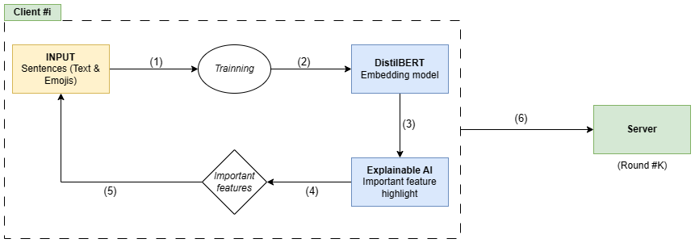

# Xmoji

Improving Emoji Prediction model using Explainable AI

## General information
* **Supervisor**: Prof. Lê Hoài Bắc
* **Reviewer**: *[Placeholder]*
* **Authors**:

	| **ID**   | **Name**            | **Email**                     |
	|----------|---------------------|-------------------------------|
	| 18120078 | Ngô Phù Hữu Đại Sơn | 18120078@student.hcmus.edu.vn          |
	| 18120259 | Lê Hoàng Mộng Tuyền | 18120259@student.hcmus.edu.vn |

* **Reporting time**: 2nd semester / 2023 - 2024 school year

## How to use
[TODO]

## Result
[TODO]

## Documents
1. [Data](./docs/data.md) (**Done**)
2. [Data processing](./docs/data_processing.md) (**Done**)
3. [DistilBERT model](./docs/model.md) (*In Progress*)
4. [META learning - MAML](./docs/maml.md) (TODO)
5. [FedAvg applying](./docs/fedavg.md) (TODO)
6. [Apply SHAP for feature importance highlight](./docs/xai.md) (TODO)
7. [Combine feature importance data & re-train model](./docs/XtilBERT.md) (TODO)
8. [Experiments](./docs/experiments.md) (TODO)

# Reference
[TODO]