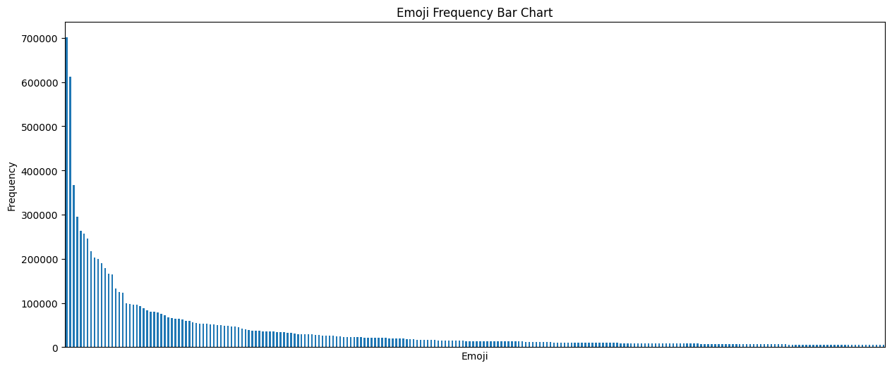

# Data processing

## Data preprocess 

### Imput

* The original dataset is stored in NDJSON format. The example for each of JSON object is represented similarly to [`sample_data.json`](../data/sample_data.json)
* For each JSON object, we only need to collect the information in the `text` property

	

### Output 
* The output dataset will be organized in CSV format with 2 properties:
	1. **TEXT**: The sentence (input) for training model, get from raw tweet in original data
	2. **EMOJI**: The label for each text

* `TEXT` and `EMOJI` will be seperated by `<tab>` character
* [`sample_data.csv`](../data/sample_data.csv): This is the example for the data constructed.
* The full data can be found [here](https://drive.google.com/drive/folders/1WohumbUpiuHfGqfKgfTucGRNzJ0OrQ-A) (Kindly contact us in case anyone need the access to this dataset)

	

### Preprocessing step

1. Colecting all tweet in original data into a TXT file. Earch row is a raw tweet 
2. As the output CSV file's seperator is `<tab>` charactor, replacing all `<tab>` with `<space>` in `#1`
3. Spliting tweet into multiple data sample. Each sample is represented as: "[TEXT] [EMOJI]" 
3. Replacing mentions and hyperlinks with special tokens (@USER
and URLHTTP respectively)
4. Filtering out tweets with less than 5 words, non-English or no
emojis
5. Eliminating emoji modifiers (e.g. gender and skin tone)
6. Filtering all data point with emoji has frequency < 5000

*Note:* 
* Data statistics:
	|     **Total clients**     |          100          |
	|:-------------------------:|:---------------------:|
	|     **Total samples**     |       10,234,609      |
	|     **Total classes**     |          234          |
	| **Mean words per sample** |      14.85+8.488      |
	| **Mean samples per user** | 100,000.28+ 14742.523 |
* Each emoji will be encoded into an ID. The mapping ID and emoji frequency will be stored in `label.csv` file. The example is [`sample_labels.csv`](../data/sample_labels.csv)
	
* Emoji distribution of dataset as below:
	


## Data organization for Federated Learning 

As for Federated Training, we prepared 3 different data generating stategies for 3 different data scenarios:

1. IID scenario
2. Non IID scenarios:
	* Case #1: Quantity-based skew 
	* Case #2: Distribution-based skew

For each scenario, the data will be distributed accross `100 clients`:
* `80 clients` for training
* `20 clients` for testing :Data for each testing client will be splited in to 2 sets (For applying `META learning`):
	* `Query set`: take 80% data point of a test client
	* `Support set`: take remaining 20% data point

Data will be organized as below:
```
data/
├── {strategy}_client_train/
│   ├── 0.csv
│   ├── ...
│   └── 79.csv
└── {strategy}_client_test/
    ├── query/
    │   ├── 80_q.csv
    │   ├── ...
    │   └── 99_q.csv
    └── support/
        ├── 80_s.csv
        ├── ...
        └── 99_s.csv
```

*Note*: `{strategy}` with value as below represent 3 strategies used:

* `iid`: IID scenario
* `quantity`: Quantity-based skew 
* `dirichlet`: Distribution-based skew

*Example:*
	

### IID scenario
* For each label, evenly distribute the number of samples among all clients. 
* Obtain data following a normal distribution.

Label distribution for each training client as below:
	

### Quantity-based skew 
* For each client, assign a specific set of labels (`labels_per_client`).
* For each label, evenly distribute the number of samples among the clients that own it.

Label distribution for each traning client (`labels_per_client` = 6) as below:
	

### Distribution-based skew 
* The number of samples within a label is divided among all clients with proportions drawn from a Dirichlet distribution ($\alpha = 0.5$)
* Consequently, each client will have a sufficient or nearly sufficient number of samples.
* This is a simulation method that closely mimics real-world non-IID data scenarios.

Label distribution for each traning client ($\alpha = 0.5$) as below:
	


